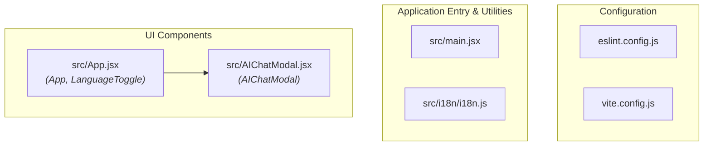

# ARCHITECTURE.md

## Overview

This document provides a high-level overview of the application's architecture, file structure, component relationships, and dependencies based on the codebase analysis.

The system is a JavaScript/React web application configured with Vite for bundling, ESLint for linting, and supporting internationalization (`i18n`) along with an AI Chat Modal interface.

---

## Architecture Diagram

The following diagram illustrates the dependency relationships between the files and key entities within the project.

---

## Project Structure & File Details

### Configuration Files

*   **`eslint.config.js`**
    *   **Dependencies:** None
    *   **Entities:** `eslint.config.js`
    *   **Description:** Configuration for ESLint code quality and style checks.
*   **`vite.config.js`**
    *   **Dependencies:** None
    *   **Entities:** `vite.config.js`
    *   **Description:** Configuration for the Vite build tool and development server.

### Application Core & Entry Points

*   **`src/main.jsx`**
    *   **Dependencies:** None
    *   **Entities:** `main.jsx`
    *   **Description:** Entry point for bootstrapping the React application into the DOM.
*   **`src/i18n/i18n.js`**
    *   **Dependencies:** None
    *   **Entities:** `i18n.js`
    *   **Description:** Handles internationalization and localization configuration.

### User Interface Layer

*   **`src/App.jsx`**
    *   **Dependencies:** `src/AIChatModal.jsx`
    *   **Entities:**
        *   `App`: Main container component for the application UI.
        *   `LanguageToggle`: UI component used for toggling language preferences.
    *   **Description:** Root application component rendering UI structures and embedding child components.
*   **`src/AIChatModal.jsx`**
    *   **Dependencies:** None
    *   **Entities:**
        *   `AIChatModal`: Modal component providing the AI chat interface.

---

## Dependency Summary

| File | Depends On | Contained Entities |
| :--- | :--- | :--- |
| `eslint.config.js` | *None* | `eslint.config.js` |
| `vite.config.js` | *None* | `vite.config.js` |
| `src/main.jsx` | *None* | `main.jsx` |
| `src/i18n/i18n.js` | *None* | `i18n.js` |
| `src/AIChatModal.jsx` | *None* | `AIChatModal` |
| `src/App.jsx` | `src/AIChatModal.jsx` | `LanguageToggle`, `App` |